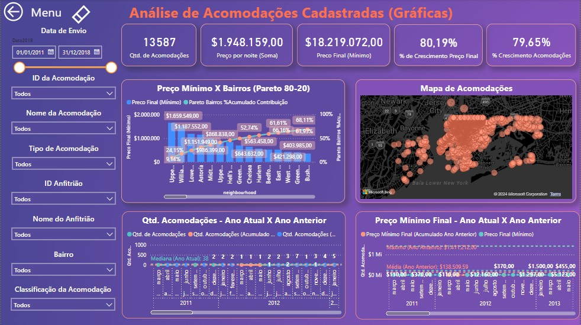
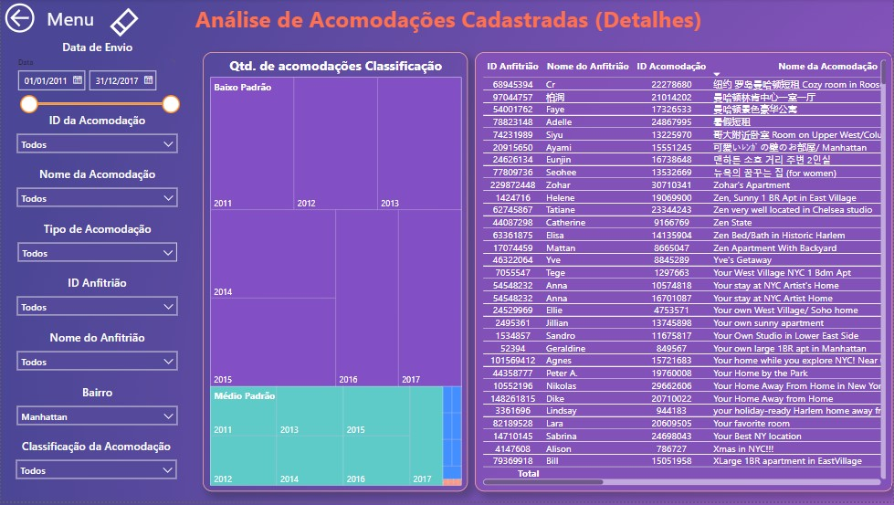

# Dashboard Airbnb
## 1. Problema de Negócio
O CEO e o Corpo Diretivo da "Tudo Aqui" estão com planos de expandir a empresa de modo a abranger o ramo de locação de quartos.

Neste cenário, você deverá desenvolver uma análise criteriosa em um novo relatório do Power BI com os dados de New York dos anos de 2011 a 2017 disponibilizados pelo Airbnb.

O CEO deseja um relatório com apenas 2 dashboards, sendo 1 com as análises gráficas e 1 com os detalhes (tabela ou matriz).

Os dados que devem ser analisados estão disponibilizados no seguinte link: https://www.kaggle.com/datasets/dgomonov/new-york-city-airbnb-open-data 

Após conversar com o CEO, vocês concluíram que as colunas consideradas na análise e seus respectivos tipos de dados deverão ser:

- last_review - Data;
- id - Número Inteiro;
- name - Texto;
- host_id - Número Inteiro;
- host_name - Texto;
- neighbourhood_group - Texto;
- neighbourhood - Texto;
- latitude - Número Decimal (Localidade Estados Unidos);
- longitute - Número Decimal (Localidade Estados Unidos);
- room_type - Texto;
- price - Número Decimal;
- minimum_nights - Número Inteiro;
- number_of_reviews - Número Inteiro.

*Dica 1: Para conseguir formatar os tipos de dados, remova nulos, brancos, dados inconsistentes e utilize o recurso “remover erros” do Power Query. Considere também fazer uma coluna por vez testando se os dados estão sendo importados corretamente para o Power BI.*

*Dica 2: Construa uma tabela calendário para desenvolver as análises de inteligência temporal.*

---

Também foi solicitado pelo CEO que você considere apenas as linhas que possuam todos os dados preenchidos em cada uma das colunas escolhidas como também colocar cada palavra em maiúsculo nos campos do tipo texto.

O CEO também deseja um menu interativo para acessar as análises com uma imagem que remeta a viagem de plano de fundo (semelhantemente ao que fizemos na disciplina).

Considere o tema “Bloom” do Power BI como identidade visual da empresa (mesmo tema utilizado na solução que construímos em aula).

**Considere:**

1. **Regra da coluna Price:**
    
    Considere como preço por noite.
    
2. **O CEO deseja fazer uma classificação própria para os tipos de acomodação:**
  - Se o Preço Mínimo Final é menor ou igual a 1.000 é "Baixo Padrão", 
  - Se o Preço Mínimo Final é maior que 1.000 e menor ou igual a 10.000, então é "Médio Padrão",
  - Se o Preço Mínimo Final é maior que 10.000 e menor ou igual a 100.000 então é "Alto Padrão",
  - Se o Preço Mínimo Final é maior que 100.000 é "Altíssimo Padrão".
  - A regra do Preço Mínimo Final é: Preço por noite multiplicado pela quantidade mínima     de noites.
    
  *Dica 3: Inclua em uma segmentação a classificação acima organizada na mesma ordem.*
    
  *Considere criar um índice para tal organização.*

## 2. Estratégia da Solução
- Construir um relatório com as princípais visões de negócio e filtros solicitados 
- Foi cinsiderado o modelo de negócio Marketplace.
- Foi decidido criar uma relatório com diferentes dashboards no Power BI.
- Para as visualizações, análise e métricas utilziando inteligência temporal foi craida uma tabela calendário relacionada a todas as tabelas com datas.

#### 2.1 Menu:
- Um menu interativo para navegação de páginas

#### 2.2 Análise Gráfica:
- Filtros de ID, nome, calssificação e tipo de acomodação, ID e nome do Anfitrião e Baiiro;
- Quantidade de Acomodações;
- Preço por noite;
- Preço Mínimo Final de reserva ;
- Percentual de Crescimento do Preço Final;
- Percentual do Crescimento de Acomodações;
- **Diagrama de Pareto 80-20** do preço mínimo da acomodação por Bairro;
- Comparativo Histórico anual Acumulado de quantidade de acomodações;
- Comparativo Histórico anual do Preço Mínimo Final;
- Mapa de acomodações cadastradas. 

#### 2.3 Análise Detalhada:
- Filtros de ID, nome, calssificação e tipo de acomodação, ID e nome do Anfitrião e Baiiro;
- Proporção de Quantidade de Acomodações por Classificação por ano
- Detalhe das acomodações 

## 3. Tecnologias usadas
- **Power BI:** Extração de dados, limpeza de dados, construção de métricas, criação das visualizações e análises dos dados.

## 4. Como executar o projeto
- Para executar o projeto localmente faça o dowlonad do arquivo "projeto_PBI_Airbnb.pbix" e execute o arquivo para visualizar a base de dados, tabelas, métricas e os dashbords criados.

## 5. Top 3 Insights de dados
- Os bairros de "Upper West Side", "Williamsburg" e "Lower East Side" correspondem a 20% do percentual acumulado de contribuição e a cerca de 80% do preço mínimo por noite;
- A maioria das acomodações cadastradas é de Baixo Padrão, sendo resposnáveis por 65.4% do preço total por noite;
- Observa-se uma queda sazonal anual no mês de fevereriro na quantidade de acomodações cadastras. Entretanto a tendência em todos os anos é de alta (no período analisado);
    - Sugestão: Realizar uma **análise diganóstica** para entender o porquê, no mês de fevereiro de todos os anos há uma queda no no cadastramento da quantidade de acomodações

### 5.1 Outros Insights
- O pico de quantidade de acomodações cadastras no mês, no período analisado foi em dezembro de 2018;
- O pico de preço mínimo para locação foi em janeiro de 2016;
- No período analisado a empresa teve um alto crescimento no preço anual e na quantidade de acomodações, sendo aproximadamente 80% de crescimento nos dois casos.

## 6. Próximos Passos
1. Automatização do dashboard após novo recebimento de dados;
2. Criar novos filtros e visualizações após novo feedback;
2. Realizar uma análise diagnóstica para estudo dos insights sugeridos no item 5.
